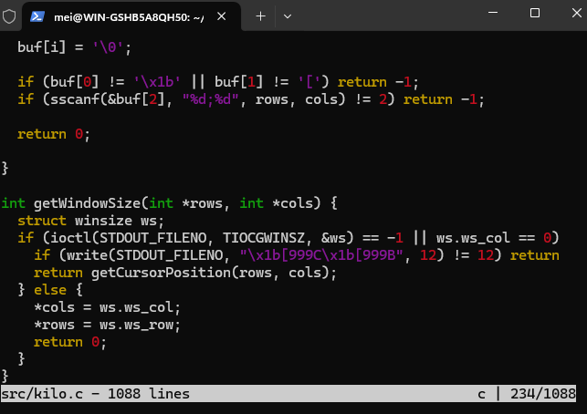

# kilo

Minimal CLI text editor written in C. 

Based  on the tutorial by snaptoken. Each commit corresponds to a step in the blog.

To run: 

```
make
```

Then pipe a file into kilo and open it:

```
./kilo <file>
```

For example opening the source code for this project:

```
./kilo src/kilo.c
```


# References

- [Blog Post](https://viewsourcecode.org/snaptoken/kilo/index.html)